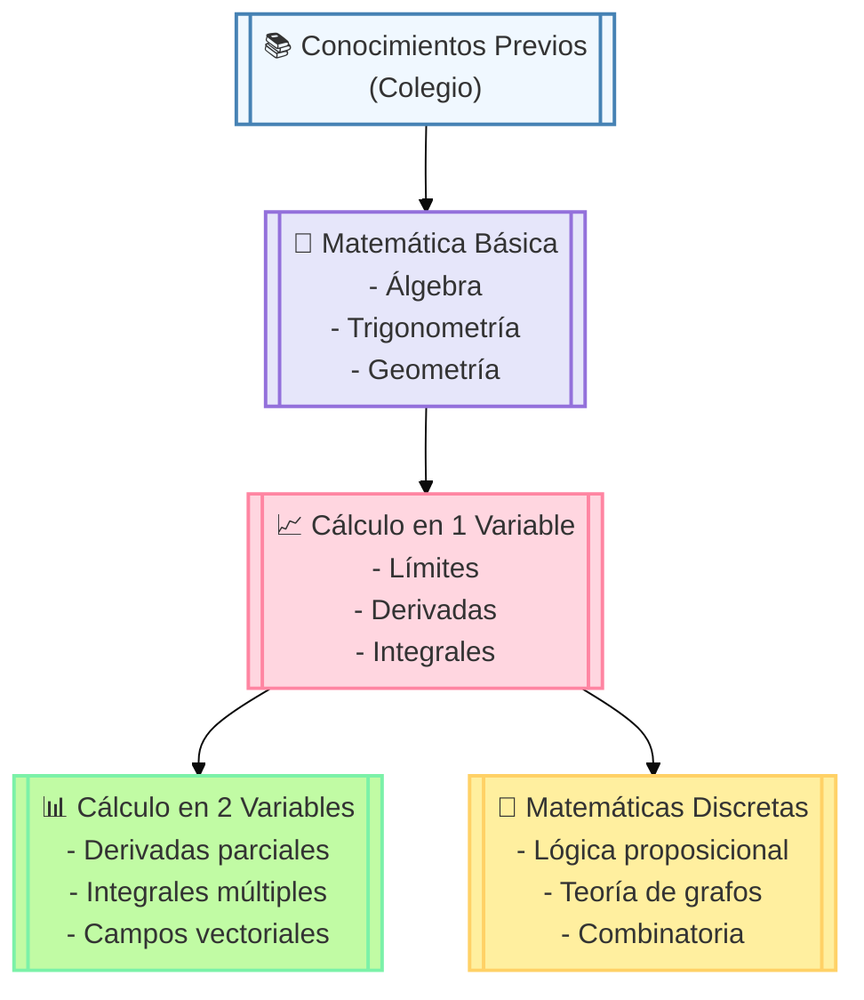
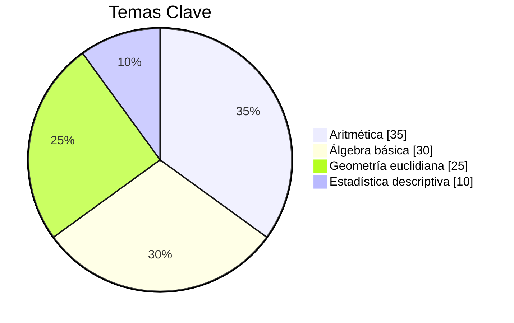
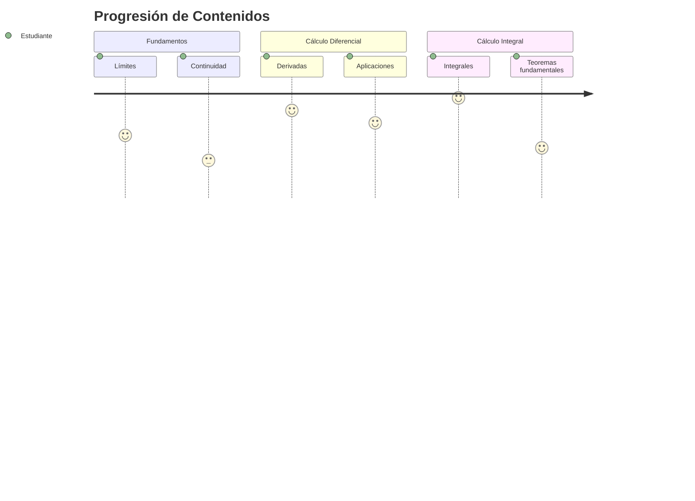
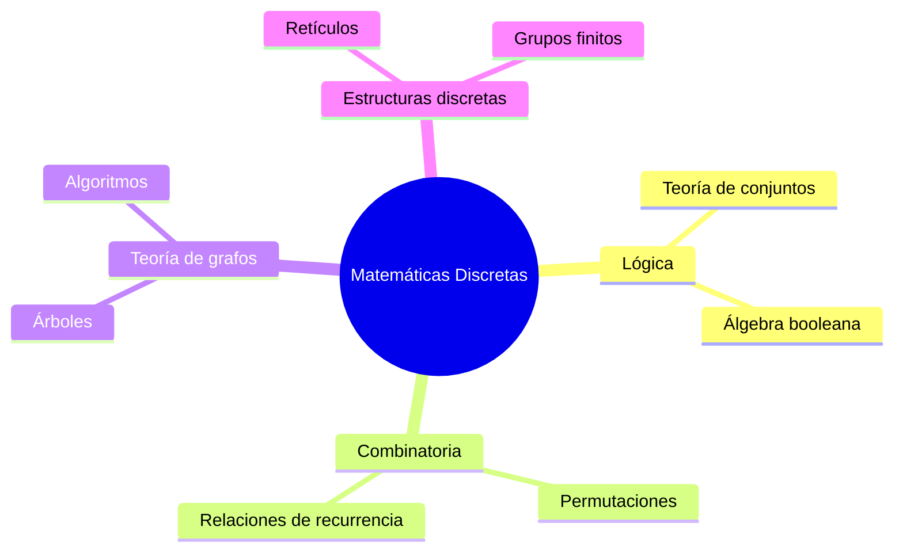

### Roadmap de matemáticas en formato Markdown con Mermaid, usando colores y estructura secuencial:

## Pasos seguidos para lograr. Este ejemplo
#Parte I
Usando una inteligencia artificial como Deepseek con el promtp
 
Creame un markdon con mermaid esquematico para aprender matematicas secuencialmente desde . 
1.**Matematica basica**
2.**Calculo e 1 variables**
3.**Calculo en dos variables** 
4.**Matematicasdiscretas**
Nota:
-Diferencia de colores y cada tipo de matematicas 
-Un color para conocimientos previos de colego un roadmap de matematica puedes
-Copiar y graba readme.me en el directorio practica\TutoriaCharlaApoyoMatematicas

#Parte II en github.

1 Creacion en  github repositorio TutoriaCharlaApoyoMatematicas

#Parte III en maquina local:
-En equipo de usuario en  directorio. Para subir a tu repositorio remoto
cd practica\TutoriaCharlaApoyoMatematicas
git init
git add readme.md
git commit -m "primer comit de matematica"
git remote add origin https://github.com/jjuarez29/TutoriaCharlaApoyoMatematicas.git
git branch -M main
git push -u origin main

Debera seguir modificando y se repite
(git init una sola vez para definir trazavilidad)
```
git add readme.md
git commit -m "primer comit de matematica"
git remote add origin https://github.com/jjuarez29/TutoriaCharlaApoyoMatematicas.git
git branch -M main
git push -u origin main
```

```markdown
# 🧮 Roadmap de Aprendizaje de Matemáticas 



## 📌 Descripción de las Etapas

### 🎓 **Conocimientos Previos (Colegio)**


### 🔢 **Matemática Básica**
- 📍 **Álgebra intermedia**
- 📍 **Trigonometría**
- 📍 **Geometría analítica**
- 📍 **Sistemas de ecuaciones**

### 📈 **Cálculo en 1 Variable**


### 📊 **Cálculo en 2 Variables**
- 🟢 Derivadas parciales
- 🟢 Integrales dobles/triples
- 🟢 Coordenadas polares/esféricas
- 🟢 Teorema de Green/Stokes

### 🔣 **Matemáticas Discretas**


## 🎨 Paleta de Colores Usada
| Área                | Código Color | Uso                  |
|---------------------|-------------|----------------------|
| Conocimientos previos | `#f0f8ff`   | Fondo azul claro     |
| Matemática básica    | `#e6e6fa`   | Fondo lavanda        |
| Cálculo 1 variable   | `#ffd6e0`   | Fondo rosa claro     |
| Cálculo multivariable| `#c1fba4`   | Fondo verde menta    |
| Matemáticas discretas| `#ffef9f`   | Fondo amarillo claro |

> 💡 **Tip**: Este roadmap es progresivo - cada etapa requiere dominar al menos el 80% de la anterior.
```

## Características destacadas:
1. **Diagrama principal de flujo** con colores diferenciados por área matemática
2. **Sub-diagramas especializados** para cada etapa:
   - Gráfico de torta para conocimientos de colegio
   - Journey map para cálculo I
   - Mindmap para discretas
3. **Paleta de colores organizada** con código hexadecimal
4. **Iconos visuales** para mejor navegabilidad
5. **Sintaxis compatible** con GitHub/GitLab (renderiza correctamente)

Puedes copiar este código directamente a un archivo `.md` en tu repositorio y se verá como un roadmap interactivo.


